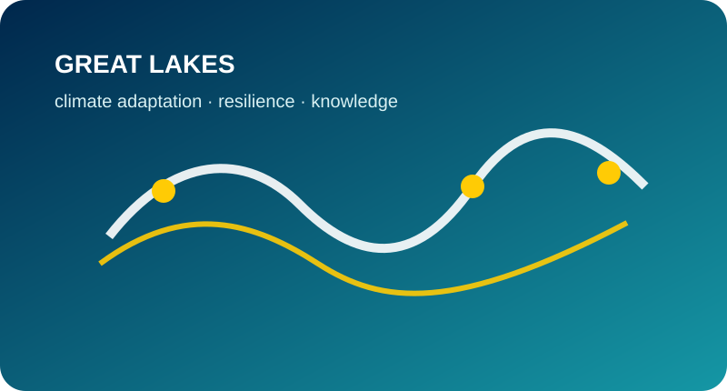
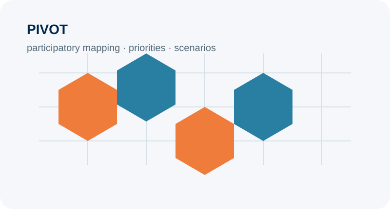
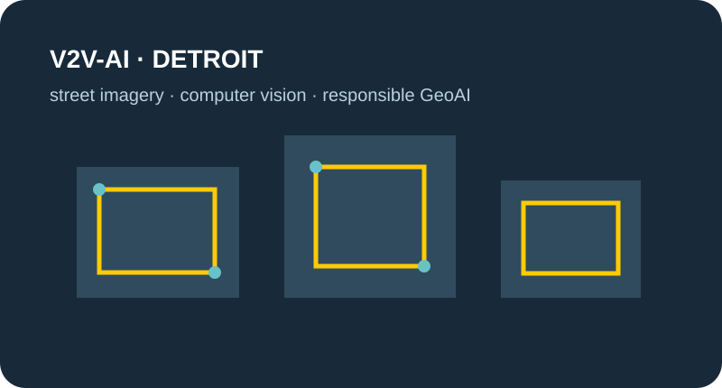
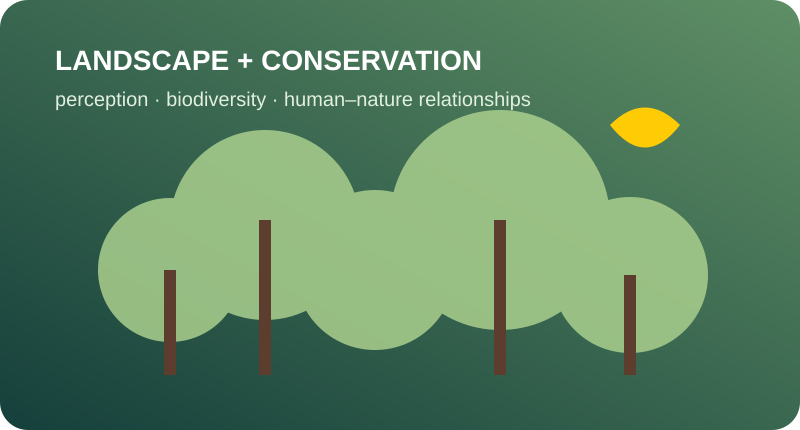

<h3>GLISA — Great Lakes climate adaptation</h3>
GLISA connects climate science with communities and decision-makers across the Great Lakes. Current work emphasizes actionable climate knowledge, flood resilience, climate migration, and tools that support local adaptation decisions.

<a href="https://glisa.umich.edu/">Visit GLISA →</a>

<h3>CLARS — Climate migration across lake regions</h3>
An international research program examining climate-related migration and urban change across the Lake Victoria Basin and North American Great Lakes. The lab leads work on urban migration modeling and contributes to climate knowledge exchange.

<a href="https://www.clarsproject.com/">Visit CLARS →</a>

<h3>CHIRRP / PUMP-COR — Flood resilience</h3>
Community-centered flood planning that integrates climate and hydrologic modeling with participatory GIS and decision-support approaches, with work in Benton Harbor and Milwaukee.

<h3>PIVOT — Participatory scenario planning</h3>
A modular web-based platform for mapping local knowledge, comparing priorities, exploring scenarios, and linking community input to environmental and urban models.

<a href="https://glisa.umich.edu/project/pivot/">Explore PIVOT →</a>

<h3>V2V-AI — Detroit housing & geospatial AI</h3>
Research with City of Detroit partners on scalable assessment of residential conditions using street-level imagery, UrbanWORM, computer vision and vision-language models, with attention to governance and responsible use.

<h3>Landscape perception & conservation</h3>
Research on human–nature relationships using social media, ecological information, visual perception, and spatial data — including wildlife communication, cultural ecosystem services, recreation, and urban forests.

## How we work
Across projects, we emphasize **open and reproducible methods**, **co-production with end users**, and **visual tools that make uncertainty and tradeoffs legible**. Many projects combine large-scale computational analysis with place-based engagement rather than treating them as separate research activities.
